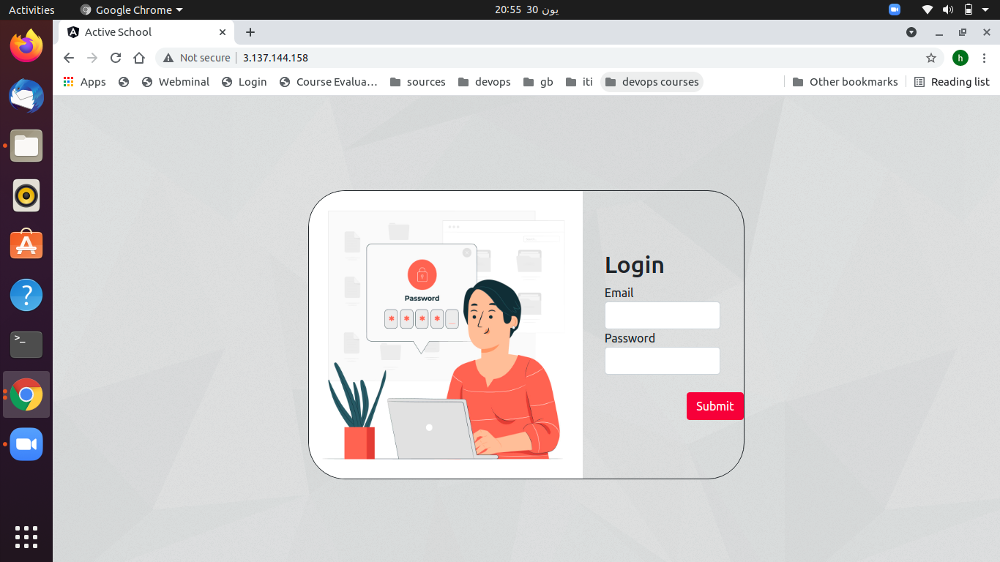
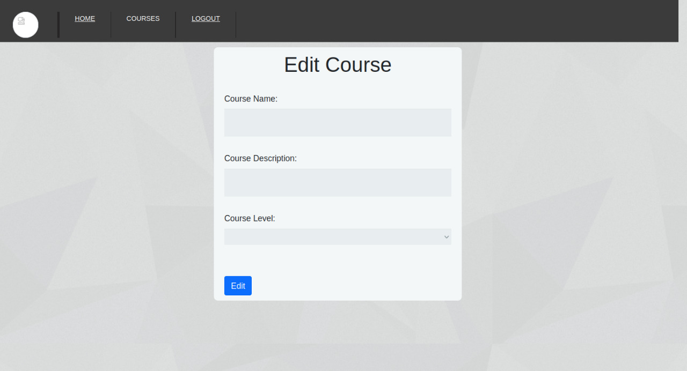
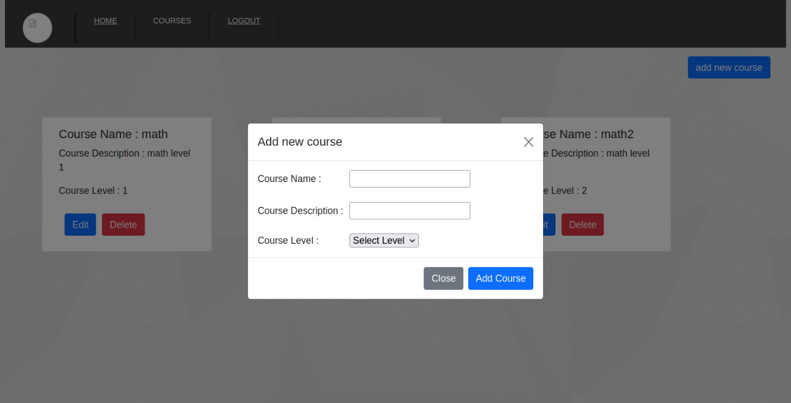
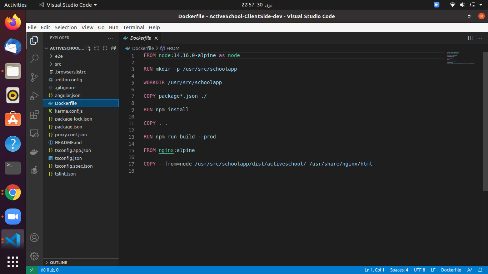
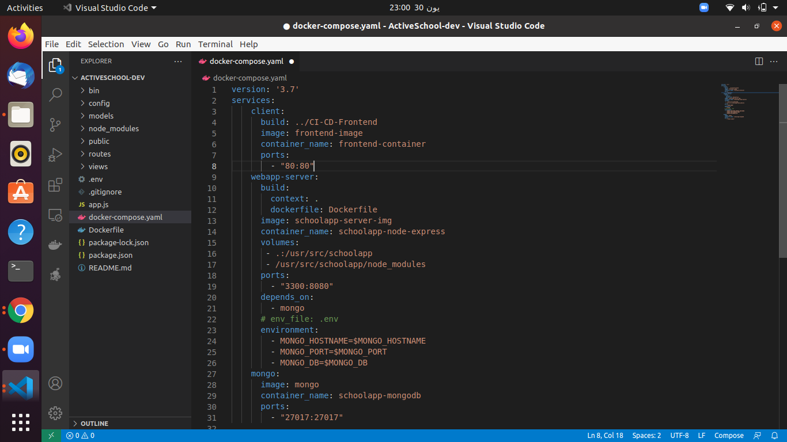

# Welcome to our Activeschool application clientside 
## To visit our website follow the link below:
http://3.137.144.158/.  
 
 
 
# Getting up and running

This project was generated with [Angular CLI](https://github.com/angular/angular-cli) version 11.2.12.

## Serverside .
Clone the serverside from this link (https://github.com/Maymaher/ActiveSchool).  

## Development server

Run `ng serve` for a dev server. Navigate to `http://localhost:4200/`. The app will automatically reload if you change any of the source files.

## Code scaffolding

Run `ng generate component component-name` to generate a new component. You can also use `ng generate directive|pipe|service|class|guard|interface|enum|module`.

## Build

Run `ng build` to build the project. The build artifacts will be stored in the `dist/` directory. Use the `--prod` flag for a production build.

## Running unit tests

Run `ng test` to execute the unit tests via [Karma](https://karma-runner.github.io).

## Running end-to-end tests

Run `ng e2e` to execute the end-to-end tests via [Protractor](http://www.protractortest.org/).

## Further help

To get more help on the Angular CLI use `ng help` or go check out the [Angular CLI Overview and Command Reference](https://angular.io/cli) page.

# Admin pages 
## Home page
   
   
    
## Teacher data 
   
   
    
 ## Add new user
   
     
    
  ## Courses page 
   
     
    
  • To edit a cousre:
    
     
    
  • To add a cousre:
    
     
    
  

# User Pages.
# Dockerize React Application.
 • Create Dockerfile to the root serverside folder.  
    
     
    
  • Create docker-compose.yml file to run Express together with mongodb.  
     
    
  • To build the images : run docker-compose build   
  • To run the containers: run docker-compose up   
# Jenkins-Pipeline-on-AWS

